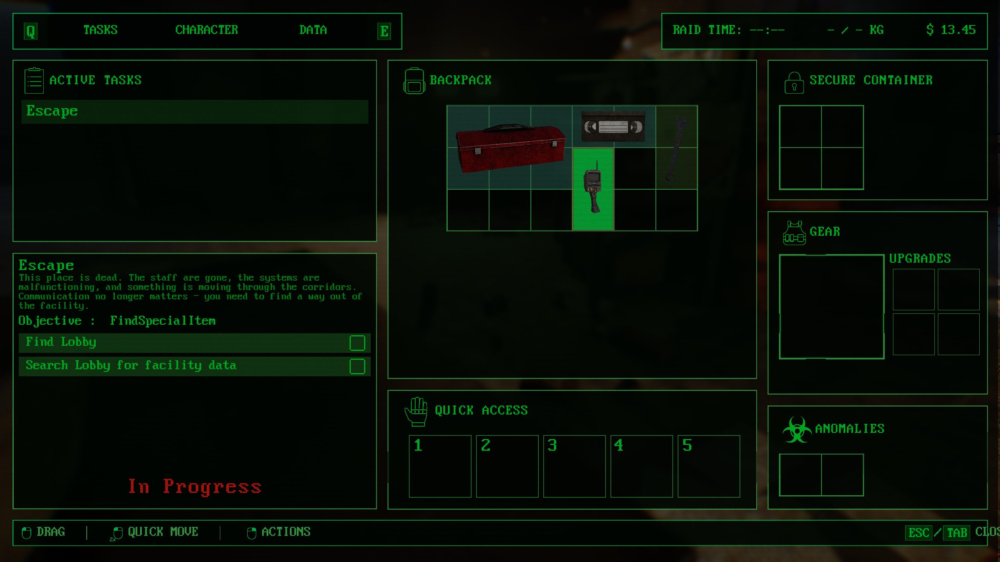

# UE5 Multiplayer Grid Inventory System

A simplified portfolio extraction of the grid-based inventory architecture developed for **DeepAnomaly**, a cooperative horror extraction game built with Unreal Engine 5 and C++.

The original production system also handles equipment, tools, batteries, clothing, anomalies, quests, crafting, shops, UI and world placement. These game-specific responsibilities are intentionally removed from this repository so the example focuses on the inventory core.

## Overview



## Demo

[▶️ Watch Inventory Demo](Media/inventory-demo.mp4)

## Features

* Variable-size inventory items
* Rectangular multi-cell placement
* Automatic first-free-position detection
* Explicit item movement
* Item rotation with fit validation
* Multiple logical inventory grids
* Server-authoritative inventory operations
* Replicated inventory state
* `OnRep` callbacks
* Custom `NetSerialize`
* UI-independent inventory change events
* Separation between inventory state and presentation

## Architecture

```text
                Client Input / UI
                       |
                       v
              UInventoryComponent
                       |
             +---------+---------+
             |                   |
             v                   v
        Add / Move /        Rotate / Remove
        Placement Logic          Logic
             |                   |
             +---------+---------+
                       |
                       v
                Server Authority
                       |
                       v
              FInventoryGrid State
                       |
                       v
                   Replication
                       |
                       v
                     OnRep
                       |
                       v
             OnInventoryChanged
                       |
                       v
                UI / Presentation
```

## Grid Placement

Each inventory item occupies a rectangular area of grid cells.

When automatically adding an item, the placement algorithm scans the grid from the top-left corner and selects the first valid position.

A position is considered valid when:

1. The entire item remains inside the grid bounds.
2. The item does not overlap an existing item.

The collision test uses axis-aligned rectangle intersection based on the item's grid position and size.

### Example

```text
Grid: 6 x 4

+--+--+--+--+--+--+
| A| A|  |  | B| B|
+--+--+--+--+--+--+
| A| A|  |  | B| B|
+--+--+--+--+--+--+
|  |  |  |  |  |  |
+--+--+--+--+--+--+
|  |  |  |  |  |  |
+--+--+--+--+--+--+

A = 2 x 2 item
B = 2 x 2 item
```

## Item Rotation

Rotation swaps the item's width and height.

Before applying the rotation, the new dimensions are validated against the grid bounds and existing items. This prevents an item from being rotated into an invalid or occupied position.

## Multiplayer & Replication

Inventory mutations are handled through server-authoritative operations.

```text
Client
  |
  | Server RPC
  v
Server
  |
  | Validate Request
  v
Inventory State
  |
  | Replication
  v
Client
  |
  | OnRep
  v
Presentation Update
```

The client requests an inventory operation, while the server validates and applies the resulting state change.

The replicated inventory grids then update clients through Unreal Engine's property replication system.

## Custom NetSerialize

`FInventoryItem` and `FInventoryGrid` implement custom `NetSerialize` functions and use Unreal Engine's `WithNetSerializer` struct trait.

This provides explicit control over how the inventory data is serialized for replication.

## Design Decisions

### Data-Oriented Runtime State

The portfolio version keeps the runtime inventory item focused on the information required by the inventory core:

* Item identity
* Grid size
* Grid position
* Item category
* Rotation state

The production DeepAnomaly implementation contains additional references and gameplay-specific data for tools, batteries, clothing, anomalies, economy, world placement and other systems.

These dependencies are intentionally excluded from this repository.

### Separation of State and Presentation

The inventory core does not directly depend on a specific UMG widget.

Instead, inventory changes are exposed through an `OnInventoryChanged` event, allowing a UI or another presentation layer to react to state changes without coupling the core implementation to a particular widget class.

### Server-Side Validation

Inventory operations are processed through the server-authoritative architecture used by the multiplayer game.

The portfolio version also performs validation of incoming operation parameters before modifying the inventory state.

## Source Relationship

This repository is **not the complete DeepAnomaly inventory implementation**.

It is an intentionally simplified portfolio extraction of the core architecture developed for the game.

The production implementation contains additional game-specific systems and integrations that are outside the scope of this example.

## Unreal Engine

Designed for **Unreal Engine 5 / C++** projects.

The generated API macro is:

```cpp
INVENTORYSYSTEM_API
```

When integrating these files into another Unreal Engine module, replace it with the API macro generated for that module.

## License

This repository contains a portfolio-oriented extraction of code developed for DeepAnomaly.

The code is provided for demonstration and educational purposes.
